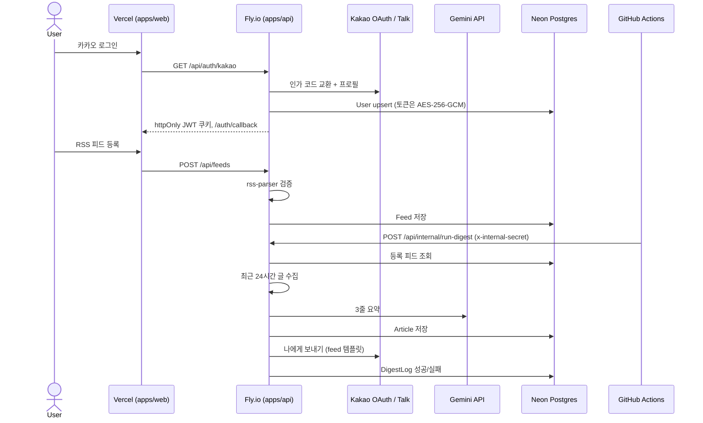

# feed-briefly

등록한 RSS 피드를 매일 수집하고, Gemini로 3줄 요약한 뒤 카카오톡 **나에게 보내기**로 아침 브리핑을 받는 개인용 뉴스 요약 서비스다.

## 사용 방식

1. 웹에서 카카오 로그인한다. `talk_message` 동의가 있어야 나에게 보내기가 동작한다.
2. 대시보드에서 RSS URL을 등록한다. 등록 시점에 실제 RSS인지 파싱해 본다.
3. GitHub Actions 크론이 매일 아침 `POST /api/internal/run-digest`를 친다.
4. 최근 24시간 글을 모아 요약한 뒤 카카오톡 feed 템플릿으로 보낸다.
5. 웹 `/history`에서 과거 요약을 다시 볼 수 있다. `지금 수집`으로 크론을 기다리지 않고 내 피드만 돌릴 수도 있다.

## 아키텍처



모노레포는 pnpm workspace다.

- `apps/api` — NestJS 11, TypeORM, PostgreSQL
- `apps/web` — React 18, Vite, Tailwind, React Query

## 로컬 실행

Node 20+ 와 pnpm(Corepack)이 필요하다.

```bash
corepack enable
corepack prepare pnpm@9.15.9 --activate
pnpm install
```

### 환경 변수

```bash
cp apps/api/.env.example apps/api/.env
cp apps/web/.env.example apps/web/.env
```

`apps/api/.env.example` 요약:

| 키 | 설명 |
| --- | --- |
| `DATABASE_URL` | Postgres 연결 문자열 |
| `DATABASE_SSL` | Neon은 `true`, 로컬 docker는 `false` |
| `KAKAO_REST_API_KEY` / `KAKAO_CLIENT_SECRET` | [카카오 디벨로퍼스](https://developers.kakao.com) REST 키 |
| `KAKAO_REDIRECT_URI` | 로컬: `http://localhost:3000/api/auth/kakao/callback` |
| `JWT_SECRET` | 세션 JWT 서명 |
| `TOKEN_ENCRYPTION_KEY` | `openssl rand -hex 32` — 카카오 토큰 암호화 |
| `GEMINI_API_KEY` | Google AI Studio 키 |
| `INTERNAL_SECRET` | 크론 엔드포인트 헤더 |
| `WEB_ORIGIN` | 프론트 origin. 쿠키 리다이렉트에 사용 |

카카오 앱 Redirect URI에 위 콜백 URL을 그대로 넣고, 동의 항목에 **카카오톡 메시지 전송**(talk_message)을 추가한다.

### Postgres

로컬 Docker:

```bash
docker compose up -d
```

Neon을 쓰려면 [Neon](https://neon.tech)에서 프로젝트를 만들고 pooled connection string을 `DATABASE_URL`에 넣은 뒤 `DATABASE_SSL=true`로 둔다. 개발에선 TypeORM `synchronize`가 스키마를 만든다 (`NODE_ENV=production`이면 꺼진다).

Upstash Redis는 현재 런타임 의존성이 없다. 나중에 수집 락·레이트 리밋이 필요하면 `REDIS_URL`을 붙이면 된다. 연결 방법은 [Upstash Redis](https://upstash.com) 콘솔의 REST/TCP URL을 복사하면 된다.

### 실행

```bash
pnpm dev:api
pnpm dev:web
```

- 웹: http://localhost:5173
- API: http://localhost:3000/api
- Swagger: http://localhost:3000/docs

```bash
pnpm --filter @feed-briefly/api test
```
